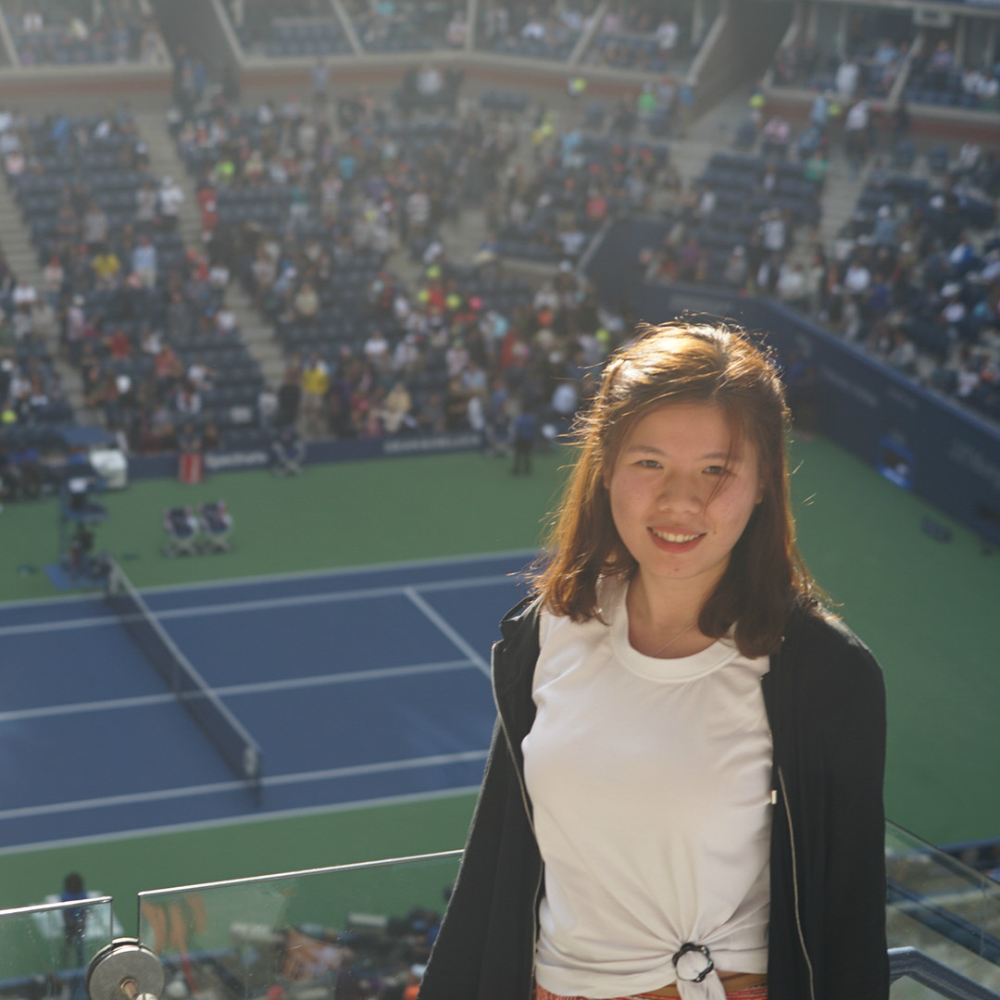

    

        

        
        

    

	Yuchao Jiang, Principal Investigator  
	<a href="https://www.dropbox.com/s/2gs7w0i8kow5glf/CV_Yuchao_Jiang.pdf?dl=0" title="Download CV as PDF">Download CV</a>  

 

    

        

        
        

    

Rujin Wang, Biostatistics PhD candidate, joint with [Dr. Danyu Lin](http://sph.unc.edu/adv_profile/danyu-lin-phd/)

 

    

        

        
        

    

Yuriko Harigaya, Bioinformatics and Computational Biology PhD candidate

 

## Alumni

Matthew Regner (2020), Bioinformatics and Computational Biology PhD rotation student  
Next position: [Hector Franco Lab](https://www.thefrancolab.org/), UNC Chapel Hill.

 

Zhiwen (Owen) Jiang (2019-2020), Biostatistics MS student  
Next position: [Ni Zhao Lab](http://www.biostat.jhsph.edu/~nzhao/), Johns Hopkins University.

Wenwen Mei (2019-2020), Biostatistics Graduate Research Assistant  
Next position: [Michael Hudgens Lab](http://www.bios.unc.edu/~mhudgens/) and [Daniel Westreich Lab](https://sph.unc.edu/adv_profile/daniel-westreich/), UNC Chapel Hill.

 

Meichen Dong (2018-2019), Biostatistics Graduate Research Assistant  
Next position: [Fei Zou Lab](https://sph.unc.edu/adv_profile/fei-zou-phd/), UNC Chapel Hill.

 

Gene Urrutia (2017-2018), Biostatistics postdoctoral research fellow, joint with [Dr. Haibo Zhou](http://sph.unc.edu/adv_profile/haibo-zhou-phd/)  
Next position: senior data scientist, [Hill-Rom](https://www.hill-rom.com/usa/).

 
