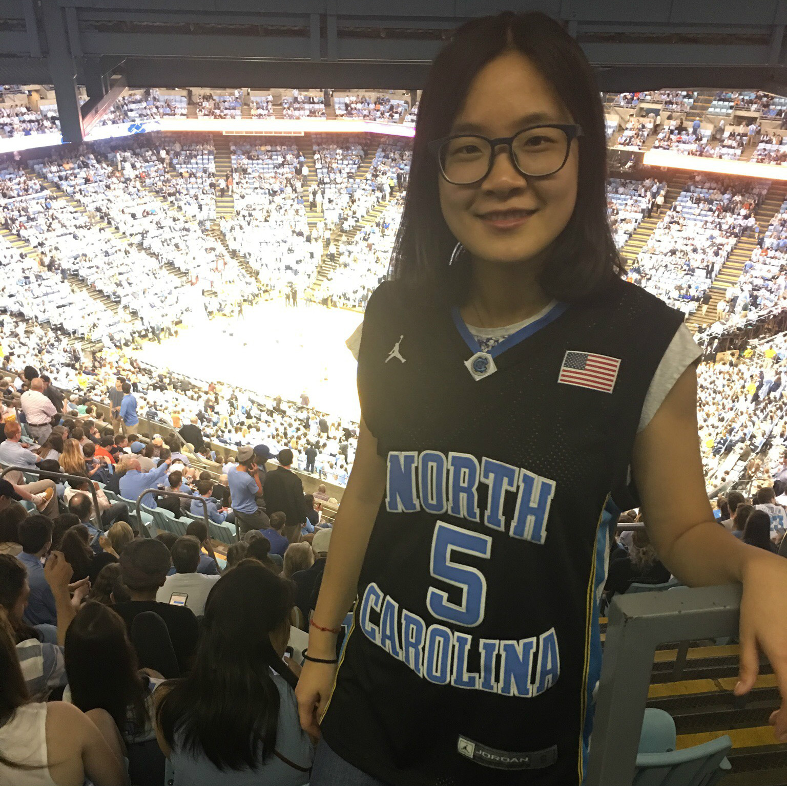

    

        

        
        

    

	Jiang Lab, Feb 2018  

 

    

        

        
        

    

	Yuchao Jiang, Principal Investigator  
	<a href="../assets/pdfs/CV_Yuchao_Jiang.pdf" title="Download CV as PDF">Download CV</a>

 

    

        

        
        

    

Meichen Dong, Biostatistics PhD candidate, joint with [Dr. Fei Zou](http://sph.unc.edu/adv_profile/fei-zou-phd/)

 

    

        

        
        

    

Rujin Wang, Biostatistics PhD candidate, joint with [Dr. Danyu Lin](http://sph.unc.edu/adv_profile/danyu-lin-phd/)

 

    

        

        
        

    

Gene Urrutia, Biostatistics Postdoctoral Research Fellow, joint with [Dr. Haibo Zhou](http://sph.unc.edu/adv_profile/haibo-zhou-phd/)
