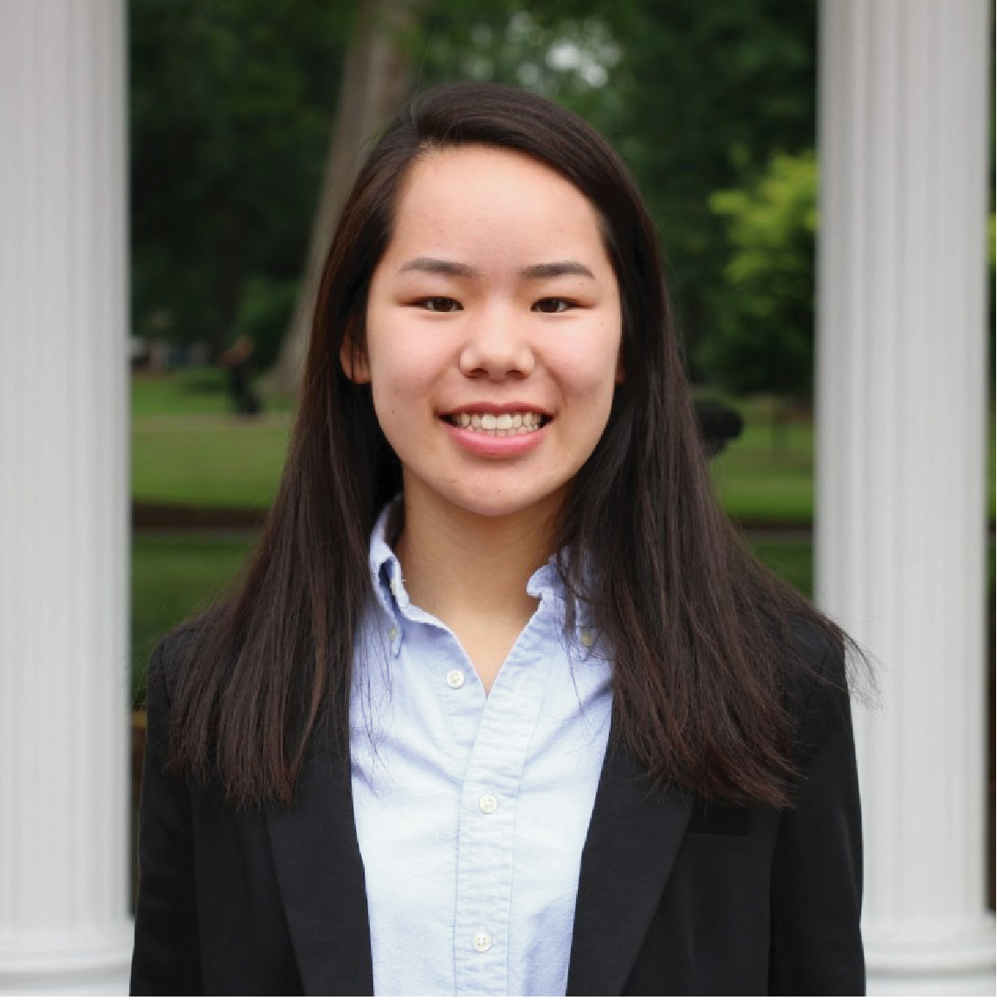

    

        

        
        

    

	Yuchao Jiang, Principal Investigator  
	<a href="https://www.dropbox.com/s/syzl3rtqjzr49di/CV_Yuchao_Jiang.pdf?dl=0" title="Download CV as PDF">Download CV</a>

 

    

        

        
        

    

Meichen Dong, Biostatistics PhD candidate, joint with [Dr. Fei Zou](http://sph.unc.edu/adv_profile/fei-zou-phd/)  
MS, Biostatistics, UNC Chapel Hill, 2016  
BS, Statistics, Chongqing University, 2014

 

    

        

        
        

    

Wenwen Mei, Biostatistics PhD student  
BSPH, Biostatistics, UNC Chapel Hill, 2019
BA, Asian Studies, UNC Chapel Hill, 2019

 

    

        

        
        

    

Rujin Wang, Biostatistics PhD candidate, joint with [Dr. Danyu Lin](http://sph.unc.edu/adv_profile/danyu-lin-phd/)  
MS, Biostatistics, UNC Chapel Hill, 2016  
BS, Financial Engineering, Capital University of Economics and Business, 2014

 

## Alumni
------

    

        

        
        

    

Gene Urrutia (2017-2018), Biostatistics postdoctoral research fellow, joint with [Dr. Haibo Zhou](http://sph.unc.edu/adv_profile/haibo-zhou-phd/)  
BS, Biology, Duke Univeristy, 2002  
PhD, Biostatistics, UNC Chapel Hill, 2013  
Next position: senior data scientist, [Hill-Rom](https://www.hill-rom.com/usa/).

 
