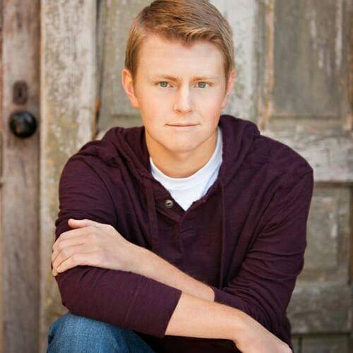

    

        

        
        

    

	Yuchao Jiang, Principal Investigator  

 

    

        

        
        

    

Meichen Dong, Biostatistics PhD candidate, joint with [Dr. Fei Zou](http://sph.unc.edu/adv_profile/fei-zou-phd/)

 

    

        

        
        

    

Zhiwen (Owen) Jiang, Biostatistics MS student

 

    

        

        
        

    

Wenwen Mei, Biostatistics PhD student

 

    

        

        
        

    

Matthew Regner, Bioinformatics and Computational Biology PhD rotation student

 

    

        

        
        

    

Rujin Wang, Biostatistics PhD candidate, joint with [Dr. Danyu Lin](http://sph.unc.edu/adv_profile/danyu-lin-phd/)

 

    

        

        
        

    

Yuriko Harigaya, Bioinformatics and Computational Biology PhD rotation student

 

## Alumni
------

    

        

        
        

    

Gene Urrutia (2017-2018), Biostatistics postdoctoral research fellow, joint with [Dr. Haibo Zhou](http://sph.unc.edu/adv_profile/haibo-zhou-phd/)  
Next position: senior data scientist, [Hill-Rom](https://www.hill-rom.com/usa/).

 
