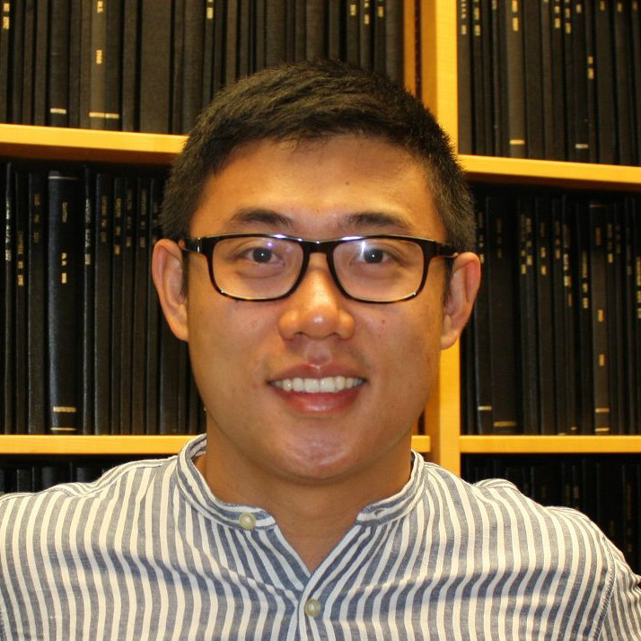
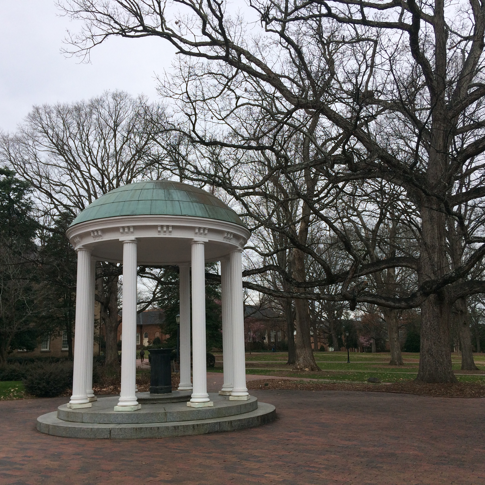
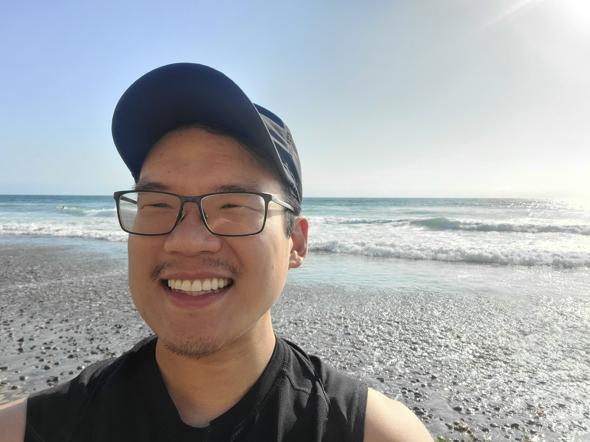
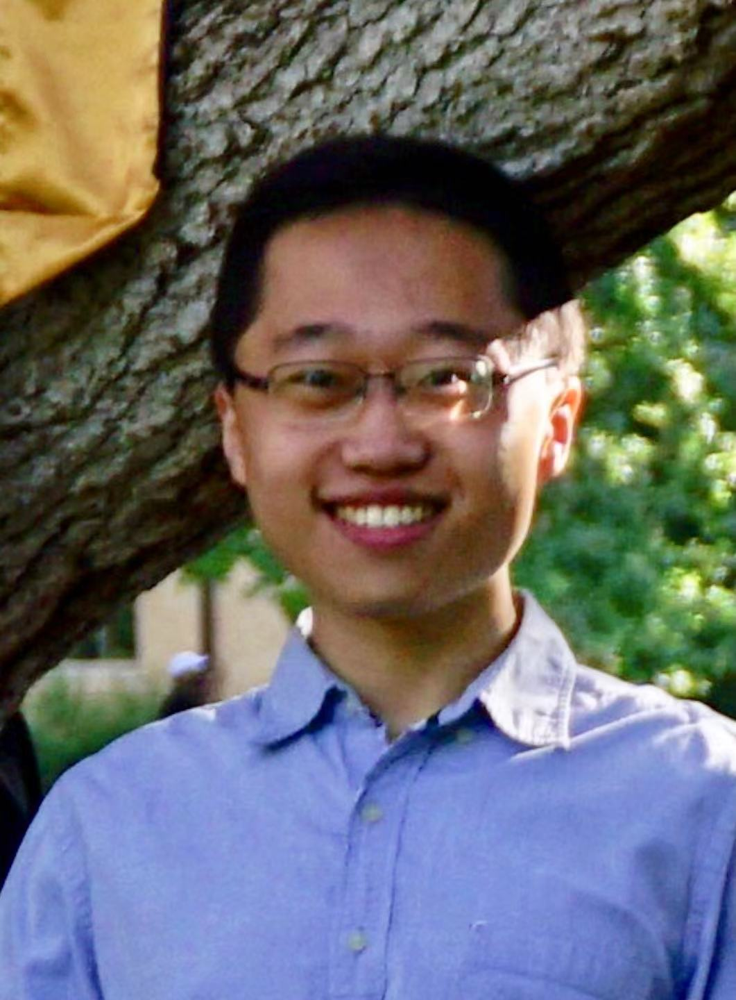

    

        

        
        

    

	Yuchao Jiang, Principal Investigator  
	<a href="https://www.dropbox.com/s/2gs7w0i8kow5glf/CV_Yuchao_Jiang.pdf?dl=0" title="Download CV as PDF">Download CV</a>  

 

    

        

        
        

    

Yuriko Harigaya, Bioinformatics and Computational Biology PhD candidate

 

    

        

        
        

    

Ann Marie Weideman, Biostatistics PhD candidate, joint with [Dr. Joe Ibrahim](https://sph.unc.edu/adv_profile/joseph-g-ibrahim-phd/)

 

    

        

        
        

    

John Lin, Bioinformatics and Computational Biology PhD rotation student, joint with [Dr. Thomas Alexander](https://unclineberger.org/directory/thomas-alexander/)

 

    

        

        
        

    

Xiaofei Wei, Biostatistics MS student

 

## Alumni

### Postdoc
Gene Urrutia (2017-2018), Biostatistics postdoctoral research fellow, joint with [Dr. Haibo Zhou](http://sph.unc.edu/adv_profile/haibo-zhou-phd/)  
Next position: senior data scientist, [Hill-Rom](https://www.hill-rom.com/usa/).

### PhD
Rujin Wang (2018-2021), Biostatistics PhD student  
Next position: senior statistical geneticist, [Regeneron Pharmaceuticals](https://www.regeneron.com/)

### MS
Zhiwen (Owen) Jiang (2019-2020), Biostatistics MS student  
Next position: PhD student, [UNC Biostatistics](https://sph.unc.edu/bios/biostatistics/)

Lihao Wang (2020-2021), Biostatistics MS student  
Next position: SAS programmer, [Jiangsu Hengrui Medicine](http://www.hrs.com.cn/)

### Research Assistant / Rotation Student
Matthew Regner (2020), Bioinformatics and Computational Biology PhD rotation student  

Wenwen Mei (2019-2020), Biostatistics Graduate Research Assistant  

Meichen Dong (2018-2019), Biostatistics Graduate Research Assistant  
